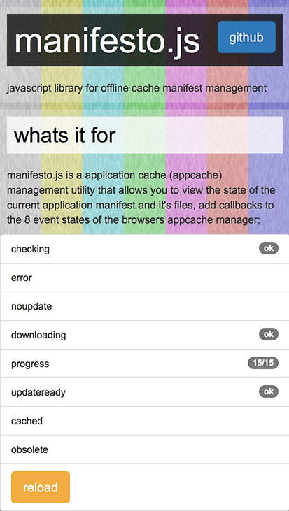
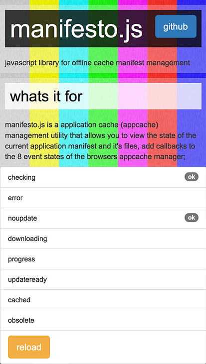
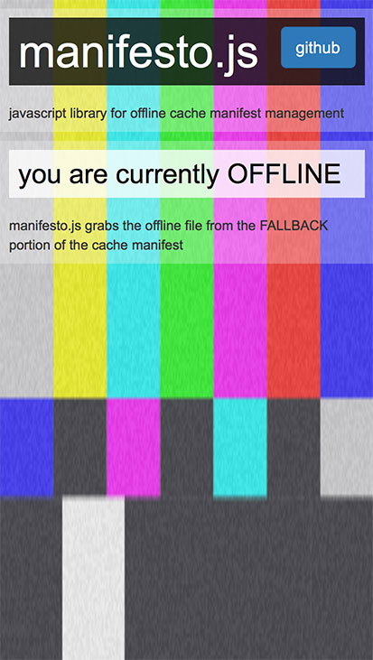

# manifesto.js
javascript library for offline cache manifest management

---

##introduction
**manifesto.js** is a small script that enables you to control the offline and stored cache manifest experience of your web app.

### design pattern
**manifesto.js** is built on a revealing module pattern exposing two (2) core methods.

* init()
* handler()

### usage
**manifesto.js** is an IIFE *(immediately-invoked function expression)* simply include the file at the bottom of your html page before the closing ***body*** tag

```
	/*
	** @description include mutlikey.js or mutlikey.min.js
	*/
	<script src="manifesto.js"></script?;
</body>;
```

####*init()*
Once you have included the multikey.js file, you can invoke the process by calling the setup method. Setup can take from 0 to 1 parameter.


#####With callbacks
```
/*
** @param cbfunc {object} callback object mapped to specific events
** within the browsers window.applicationCache event listeners
*/

/*
** declare callbacks
** note: you can optionally pass only the events you wish to listen too
** not all are required if you pass the cfbunc argument to init()
*/
var cbfuncs = {
	checking:progress.state,
	error:false,
	noupdate:progress.state,
	downloading:progress.state,
	progress:progress.state,
	updateready:progress.state,
	cached:progress.state,
	obsolete:progress.state
};

/*
** with callbacks
*/
manifesto.init(cbfunc);

```
in the instance above, all the callbacks map to a method within progress class. you can leverage the progress class in the [progress](js/progress.js) file to do your bidding :)

#####Without callbacks
```
/*
** without callbacks
*/
manifesto.init();
```


##example
----------
Below is a quick screengrabs of the script running

#####Caching progress in action


#####Cached check and noupdates


#####No Connection (offline) redirect
*note: in order to test the offline redirect in **Firefox**, you will need to invoke **File>Work Offline***


view the [example](index.html) file for more information.
or check out the [live example here](http://manifestojs.32teeth.org/)


